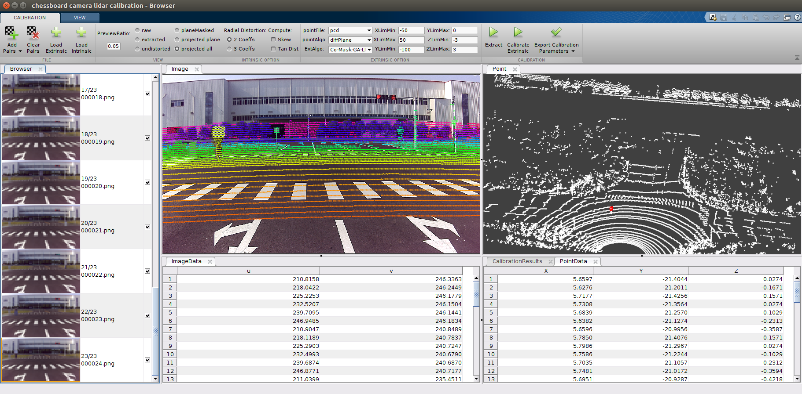

# chessboard_camera_lidar_calibration_toolbox

## CoMask: Corresponding Mask based End-to-End Extrinsic Calibration of Camera and LiDAR [[paper](https://www.mdpi.com/2072-4292/12/12/1925)]
<!-- based on corresponding mask of the laser -->

 

## Citation
If you find our codes and method useful to your work, please consider citing this work:

    @Article{YIN2020-camera-lidar-calibration,
    AUTHOR = {Lu Yin, Bin Luo, Wei Wang, Huan Yu, Chenjie Wang and Chengyuan Li},
    TITLE = {CoMask: Corresponding Mask-Based End-to-End Extrinsic Calibration of the Camera and LiDAR},
    JOURNAL = {Remote Sensing},
    VOLUME = {12},
    YEAR = {2020},
    NUMBER = {12},
    ARTICLE-NUMBER = {1925},
    ISSN = {2072-4292},
    DOI = {10.3390/rs12121925}
    }

## Introduction
This is a matlab-GUI based toobox to calibrate the camera and lidar using the CoMask-based end-to-end method. 

**We propose a fully automatic end-to-end method based on the 3D-2D corresponding masks (CoMask) to directly estimate the extrinsic parameters with high precision. In particular, a simple subtraction is applied to extract the candidate point cluster from the complex background, then the 3D LiDAR points located on the checkerboard are selected and refined by spatial growth clustering. Once the distance transform of the 2D checkerboard mask is generated, the extrinsic calibration of the two sensors can be converted to the 3D-2D mask correspondences alignment. A simple but efficient strategy combining genetic algorithm with Levenberg-Marquardt method is used to solve the optimization problem without initial guess but can still converge to accurate result. Both simulated and real experiments show that the proposed method can get accurate result without manual intervention, special setup, and approximate initial guess in advance. Compared with the state-of-the-arts, our method has obvious advantages in accuracy, robustness and noise resistance.**  

The package is used to calibrate a Lidar with a camera. Specially, the csi camera has been successfully calibrated against Velodyne VLP-16 and Hesai P40P using `chessboard_camera_lidar_calibration_toolbox`. We show the reprojection error by projecting the plane Lidar points to the image plane, which has high accuracy. You can also load other image-lidar pairs captured by the same setup to see the calibration accuracy.  
  
The package finds a rotation and translation that transform all the points in the LiDAR frame to the (monocular) camera frame.  

## Table of Contents
* [Setup](#1)
    - [matlab](#11)
    - [g2o](#12)
    - [sophus](#13)
    - [mex-build](#14)
* [Getting Started](#2)
    - [data preparation](#21)
* [Usage](#3)
* [A Simple Demo](#4)
* [Parameters Description](#5)
* [Future Improvements](#6)

## Setup  
The toolbox is so easy to setup due to the depenence only on [matlab](https://www.mathworks.com/products/matlab.html).  
1. matlab  
For more support for ROS-interface, we strongly suggest you upgrade your matlab version at least after `2017b`. 
2. g2o  
G2O is used to solve the LM optimization problem.  
`cd ./thirdParty/g2o/`  
`mkdir build`  
`cd build`  
`cmake ..`  
`make & sudo make install`  

3. sophus  
sophus is used to convert the problem from euler space to se3 space.  
`cd ./thirdParty/Sophus-1.0.0/`  
`mkdir build`  
`cd build`  
`cmake ..`  
`make & sudo make install`  

3. mex-build   
`cd ./utils/cloudSegmentation`  
`build.m`  
`cd ./utils/optimization`  
`build.m`  

## Getting Started  
The toolbox depends on the image-points-pairs with chessboard. The quality of the data has some relationship of the calibration results. 

1. Data Preparation  
You should prepare the time-sychronized image-points pairs with chessboard exsiting within the overlapped field view of both the camera and Lidar. You do not need too much observations and the distance and orientation of the checkerboard do not has too much limiatation. You can get the sample data with 25 observation from [here](https://drive.google.com/open?id=1zyUtEY5XvnpCCHNaBnGIHAplFIGuCOkX)  

    When you are intend to prepare your data, you should keep these key points in mind:  
    - <b>
    The LiDAR points and camera images should be time sychronised.
    </b>  
    - <b>
    If your system does not have hard synchronization, then the time synchronization between your image and the laser point cloud pair cannot have a very good synchronization effect. But you can use some methods to alleviate the asynchrony of time.  
      - If you are using your data packets recorded by the ROS system, you can use the system timestamp as the timestamp of the data, so that you can get the data pair with the closest time through the correlation of the timestamp.  
      - If your data is generated and recorded when there is a data transmission delay or storage delay, this will make the effect of synchronizing the point cloud and image data only through the system time stamp worse. In other words, there may be a systematic time deviation between the image and the point cloud data. At this time, you can add this deviation compensation when generating the data pair. The matlab-GUI framework we provide has a toolkit to deal with such problems, which will be further introduced later.  
      - If the time synchronization of your system cannot be guaranteed, you need to be as careful as possible when recording data. You can keep the scene still while collecting data at the observation point you think is better, so that you can eliminate the data asynchrony caused by time asynchrony to a certain extent. Our MATLAB-GUI provides a tool interface for manually selecting observation data.  
    </b>  
    - <b>
    The image of the checkerboard target and the laser point cloud pair data need to be recorded and placed in the first frame of the data.  
      - The core of our algorithm is to accurately and robustly extract the checkerboard pairs in the image and laser point cloud. In order to avoid using too many parameters and guidelines to filter out non-checkerboard targets in the laser point cloud, we adopted the point cloud subtraction method to obtain the new point cloud in the scene, that is, we need to record a background point cloud , And then obtain the remaining point cloud containing the main target by making the difference between the point cloud with the target and the background point cloud.  
      - When extracting checkerboard pairs, our algorithm will default to storing the static background in the first frame, so the frame numbers of the static background data are taken as "000001.pcd" and "000001.png". Of course, our code framework also supports point clouds and images in other formats, but we recommend that you use the pcd format to store point clouds and the png format to store images, and please note that the number of our data has been named and is similar to the KITTI data set .  
    </b>  

## Usage  

### 1. Main GUI  

  

You should first run `multimodal_data_studio.m` to launch the GUI as the above.  When the matlab ask you if you want to **change your path** or **add to the path**, you should choose **change your path** to focus on the current path.  
There is a button on the main interface, corresponding to the **toolkit for data visualization and data synchronization segmentation**, **the toolkit for lidar and image calibration**, and the **toolkit for camera internal parameter calibration**.  

| toolkit | function description  |
|:------------:|:-----:|
| toolkit for data visualization and data synchronization segmentation | Multiple ROSs data packets can be read in through the matlab interface, and other data can be synchronized and visualized based on a certain topic, and all or part of the synchronized data can be extracted and stored locally. This tool also supports manually selecting the synchronization data frames of interest and sequentially storing them locally. |
| toolkit for lidar and image calibration | The tool provides a series of graphical interfaces for parameter setting, intermediate results and rendering of final results. At the same time, the tool also provides an interface for loading and exporting calibration files. |
| toolkit for camera internal parameter calibration | The core of the toolbox is to use the official function of matlab to realize the Zhang Zhengyou calibration method of the expected checkerboard. It only simplifies the interface on the original basis and supports the output of the calibration file that meets our format. |  

<b>
The graphical interface provides the convenience of operation, but objectively brings the complexity of the operation, especially the problem of mutual influence of the operation. This description focuses on how to use lidar and camera calibration, so only a general description of the tool.
</b>

### 2. GUI for toolkit of camera-lidar-calibration  

  

  

When you click the Lidar and camera calibration button on the main GUI, you can enter the camera and lidar calibration toolbox. This toolbox has two GUI interfaces, one is the interface that mainly contains operations, and the other is the main and view The relevant interface is shown in the above two figures.  

Below we will explain the general function of these operation buttons:  

| sub-toolkit | function description  |
|:------------:|:-----:|
| 1 | Load data, there are two sub buttons under this function button, one is to load from rosbag, the other is to load from file. Currently we only support loading from files. If it is a rosbag data package, you need to use our data package tool to synchronize and split the data first. When you click Load from File, a dialog box will appear in which you need to select the location of the image and lidar file, as well as some setting parameters about the checkerboard. |
| 2 | Clear the existing data, this operation will clear the relevant data currently in the workspace, but will retain some of the modified parameters. |
| 3 | Load the external parameter file in yml format. The format of the external parameter file and internal parameter file that we can read and export can be read, written and output with the yaml library, and the format is similar to that used by autoware. Clicking this button will let you select a file to load, and you can observe the rendering effect through the loaded external parameter file. |
| 4 | Load the internal reference file in yml format. The toolkit currently only calibrates external parameters separately. To calibrate external parameters, you need to know the internal parameters of the camera, so you need to import the internal parameter file before extracting the checkerboard mask, otherwise it will report a warning. |
| 5 | Preview zoom factor. We use this value to reduce the original image in the data bar for preview. The larger the value, the faster the zoom-out operation will proceed, but the blurry the preview image, the smoother the preview. The smaller the value, the slower the zoom-out operation will proceed, but the clearer the preview image, the more the preview will freeze. |
| 6 | View options. The radio button mainly affects the content of the image view. Select "raw" to display the original image in the image view; select "extracted" to select the image with the corners of the checkerboard in the image view; select "undistorted" to display the internal parameters in the image view. Distorted image; select "planeMasked" to display the rendered image of the checkerboard mask in the image view; select "projected plane" to display the rendered image of the checkerboard in the point cloud in the image view Result; select "projected all" to display the result of projecting all point clouds in the image perspective onto the image in the image view. |
| 7 | Internal parameter calibration option. Our framework not only inherits the methods described in this paper, but also integrates some methods such as autoware. Some of these methods are used to calibrate internal and external parameters together, so we have also added internal parameter calibration options corresponding to these methods. The meaning of these options is consistent with the meaning of the calibration tool in matlab, mainly including the setting of the distortion coefficient. If you import the internal parameter calibration file directly, you can ignore this option. |
| 8 | Parameter setting button. The first setting is the supported point cloud format. We currently only support point cloud formats such as "pcd" and "bin". The second one sets the point cloud extraction method. We use the point cloud subtraction method to process the point cloud by default. We recommend not to modify this option. The third parameter is the choice of external parameter calibration method. The default option is "Co-mask-GA-LM", which is to use the corresponding mask combined with GA and LM methods to optimize the external parameters, which corresponds to the method of this paper. There are some other supported methods, you can also try. |
| 9 | Point cloud range setting parameters. Mainly set the minimum and maximum values of XYZ in the point cloud. Only the point clouds within these ranges will be displayed in the point cloud window. Modifying the range of the point cloud directly will immediately refresh the rendering view of the current point cloud. |
| 10 | Extract button. Click this button to extract the corner points of the checkerboard in the image in turn, and extract the checkerboard mask in the checkerboard according to the corner points. At the same time, the point cloud belonging to the checkerboard in the point cloud will be extracted. |
| 11 | External parameter estimation button. Clicking this button will start to estimate the external parameters and output the corresponding log in the command window. |
| 12 | External parameter output button. Our output format currently only supports autoware-like yml format files. Clicking this button will first check whether the external parameters have been calibrated, if yes, then you will be asked to select the file name and path of the export file. |
| 13 | Data navigation window. You can browse the data according to the thumbnail of the image. Clicking on a different thumbnail will set the serial number corresponding to the thumbnail to the current serial number, and the corresponding content will be displayed in the image view, laser point cloud view, and other related views. |
| 14 | Data selection box. The checkbox box behind the data browsing box is to choose whether the data will participate in the final external or internal parameter estimation. It is impossible to extract checkerboards from images and laser point clouds to be 100% correct. For incorrect or low-quality extraction, you can check the checkbox so that it will no longer participate in the calculation. |
| 15 | Image view. Display the display results related to the image. |
| 16 | Point cloud view. A view showing the results related to point cloud processing. |
| 17 | Data views related to images. Mainly display the UV coordinate system of the corners of the checkerboard. |
| 18 | Data views related to point clouds. It mainly displays the 3D coordinates of the checkerboard in the laser point cloud. |
| 19 | View operation tools. Select the image view or the point cloud view, and then select the tool operation view. At present, the main use and no problem is to use zoom and rotate operations on the point cloud view. Please note that there are two types of zoom, one is based on "Limit" and the other is based on "camera". The zoom effects of the two are different and are related to the rotation operation. About zoom to selection, you can use the right button to switch in the zoom state. |
| 20 | Point cloud rendering mode selection button. Currently, 4 choices are mainly supported, using "plain", "range", "height" and "intensity" respectively. Changing this option will have an immediate effect on the point cloud field of view.|
| 21 | Point cloud size selection. This box is an edit input box, you can enter legal numbers. This number indicates the size of the point cloud rendering. This value will not only affect the size of the point cloud display in the point cloud view, but also affect the rendering effect of the point cloud in the image. |
| 22 | The effect of point cloud rendering in the image. Currently, four options such as "plain", "range", "height" and "intensity" are also supported. Changing this option will modify the way the point cloud is rendered in the image. The modification of this option will have an immediate effect in the image view, provided that the current display mode is point cloud rendering into the image. |
| 23 | External parameter display and modification interface. The 6 edit boxes are the display and edit interface of external parameters. We can refresh and display the current external parameters stored in the memory through the 24 buttons. And you can modify the external parameters manually or through the plus and minus keys. Modifying the external parameters will dynamically affect the rendering effect of the point cloud in the image. |
| 24 | External parameter refresh button. By clicking this button, the latest modified or estimated external parameters will be refreshed in area 23. |
| 25 | Internal parameter distortion selection button during point cloud projection. If “distorted” is selected, the internal parameter distortion of the camera will be taken into consideration when the point cloud is projected into the image. If “undistorted” is selected, the internal parameter distortion of the camera will not be considered when the point cloud is projected into the image. |

## A Simple Demo  

### 1. Prepare Your Data

  

**The relevant points of data preparation have been mentioned above. Here is a sample data provided as an example to illustrate the composition form of the data that needs to be prepared.**  

**You can get the sample data with 25 observation from [sample_data](https://drive.google.com/file/d/1AlhlXkwabZbQAurNrabzHxW0Ocy0AuVf/view?usp=sharing), [sample_data_config](https://drive.google.com/file/d/1LHYJi2ZYDEQjNk_DMrnr5lyv881c_zY2/view?usp=sharing), you should download the data and config files and extract them, and then put them under the same directory.**

| Directory and file name | function description  |
|:------------:|:-----:|
| cam_front | The directory where pictures are stored, where the files are named as 6-digit numbers, such as 000001.png. The name of the folder can be anything. |  
| cam_front_left | The directory where pictures are stored, where the files are named as 6-digit numbers, such as 000001.png. The name of the folder can be anything. |  
| lidar0 | The directory where point clouds are stored, where the files are named as 6-digit numbers, such as 000001.pcd. The name of the folder can be anything. |  
| cam_front_intrinsic_coGA.yaml | Camera internal reference file. The name of the file can be taken at will. |  
| cam_front_left_intrinsic_coGA.yaml | Camera internal reference file. The name of the file can be taken at will. |  
| cam_front_to_lidar0_intrinsic_coGA_extrinsic_comask_lmg2o.yaml | External reference file calibrated using the method of this article. Here is a reference example. You can load the calibrated file into rendering to see how the projection effect is. |  
| cam_front_left_to_lidar0_intrinsic_coGA_extrinsic_comask_lmg2o.yaml | External reference file calibrated using the method of this article. Here is a reference example. You can load the calibrated file into rendering to see how the projection effect is. |  

### 2. Load your data

  
Press button 1 to call up the dialog box for loading data, in the dialog box, set the directory of the file you want to calibrate and the corresponding parameters of the checkerboard. The parameters of the checkerboard can be modified when loading the data. The default values are explained in the "camera_lidar_calibration_config.yml" file, and the meaning and settings of the parameters will be explained later.  

### 3. Load the intrinsic file

  
By calling button 4, the dialog box for loading the internal parameter file is called, and the corresponding internal parameter file is selected.  

### 4. Load the intrinsic file

  
By calling button 4, the dialog box for loading the internal parameter file is called, and the corresponding internal parameter file is selected.  

### 5. Set your parameters
The basic parameter settings are completed through the content of the setting button 9, including the point cloud type, the point cloud extraction checkerboard method, and the point cloud range. The default values of these parameters are stored in the "camera_lidar_calibration_config.yml" file. For your special point cloud, the parameters may be slightly different. You can modify the above configuration file, or you can modify it online on the tool. The part of the point cloud containing the checkerboard is filtered out by the range. We only process the point cloud within the filtering range, so you need to pay attention to whether your parameter settings are correct.  

### 6. Extract the checkerboard from the image and pointcloud
The checkerboard is extracted by calling button 10. When you click button 10, you will see a progress bar for processing the image, and the processing information will be displayed when the image is processed. Click "ok" to proceed to the next step.  

  

After clicking "ok", the point cloud data will continue to be processed, a processing progress bar will appear, and the relevant logs of the extracted point cloud can be seen in the "command" window. After this process is complete, you can see the results of the processing.  

  

After the point cloud processing is completed, click "ok", the platform will extract the processed effective point cloud pair, and refresh the data column on the left. Invalid data pairs will no longer be displayed.  

### 7. Browse and check your extraction results
You can set button 6 to modify the rendering effect. For example, select "extracted" to display the result of checkerboard corner extraction in the image window, and display the result of checkerboard extraction in the point cloud window. As shown in the figure, in the image window, the checkerboard corner points are displayed with blue crosshairs, and in the point cloud window, the checkerboard point cloud is rendered in red.  

  

  

### 8. Do the extrinsic calibration
Start external parameter calibration by calling button 11. Using the "comask-ga-lm" method will first use the genetic algorithm to obtain a roughly correct initial parameter, and then use the LM method to obtain an accurate result based on this. During the calibration process, the corresponding log information will be output in the "command" window of matlab. After the calibration is completed, you can see the external parameters of the calibration output in the data window of the laser point cloud and in the area 23 through the refresh button 24.  

  

  

### 9. Preview your calibration quality
Preview the accuracy of external parameter calibration by rendering the laser point cloud onto the image. You can set different rendering modes, or render all point clouds on the image, or just render the checkerboard point clouds on the image.  

  

  

### 10. Select the data and re-calibrate 
The quality of the rendering can be judged by rendering the point cloud, especially the checkerboard point cloud, onto the image. Possibly due to the adjustment of parameters and the degradation of data quality, the extraction accuracy of the checkerboard is poor. For example, the point cloud that is not a checkerboard is extracted into a checkerboard or the extraction of the checkerboard point cloud is incomplete. At this time, you can uncheck the frame data to remove the influence of the frame data on the results, and click the 11th button to recalibrate.  

### 11. Save your calibration results
Press button 12 to save the calibration result as data in yml format.  

  

  

## Parameters Description  
The core of the algorithm in this paper is divided into two parts, one is the extraction of the corresponding checkerboard in the image and point cloud, and the other is the calibration of the external parameters based on the corresponding mask. These links all involve some parameters, and the selection of some parameters has a certain influence on the accuracy of the calibration results, so additional attention is needed.  
**Our parameters are mainly initialized by default in the "camera_lidar_calibration_config.yml" file. Now we will briefly explain the default values, meanings and setting opinions of the parameters in this file. Regarding the further adjustment of these parameters, you can put forward comments in the issue, and the author will explain and reply to comments as soon as possible.**  

| paramter | default value | Description |
|:------------:|:-----:|:-----:|
| chessboardProperties | 7, 9, 0.1085 | The meaning of the parameters are the number of checkerboard squares in the horizontal direction, the number of checkerboard squares in the vertical direction, and the side length of the checkerboard squares. The unit of the side length value is meters. |
| pointFileType | pcd | The type of point cloud data. Currently supported are "pcd" and "bin" formats. |
| pointcloud_limit | -50, 50, -100, 0, -3, 3 | The extent of the point cloud. This is x_min, x_max, y_min, y_max, z_min, z_max, the unit is meters. You can use GUI tools to adjust these parameters online to determine the XYZ distribution range of your perception area. |
| planeFitParams | 0.02, 0, 1, 0, 70 | RANSAC extracts the parameters of the plane. The first parameter is the maximum allowable distance from the plane from the point judged as an interior point. The smaller the value is, the stricter the requirements on the flatness of the point cloud. The larger the value, the more relaxed the requirement for the flatness of the point cloud. The method in this paper does not rely on the planarity of the checkerboard, but only requires the checkerboard point cloud to be complete. Therefore, the value can be increased appropriately without generating error outer points. The second to fourth values constitute a 3D vector, which is the reference normal vector of the plane equation where the checkerboard is located. The last parameter is the maximum angle between the checkerboard plane allowed to be extracted and the normal vector, in degrees. |
| planeFitParams_stage_1 | 0.08, 0, 1, 0, 70 | In order to ensure the completeness of the point cloud extraction and at the same time to resist noise, we use two stages to estimate the checkerboard point cloud. The meaning of this parameter is the same as the above, except that the first parameter of the first stage has a larger value and the second stage has a smaller value. |
| planeFitParams_stage_2 | 0.02, 0, 1, 0, 70 | - |
| distanceMat_T | 0.05 | Perform a 2D projection on the extracted checkerboard point cloud to obtain a binary image, and process the connectivity to remove the outer points that adhere to the checkerboard. This value is the threshold for binarization, and the unit is meter. Refer to the paper for specific meaning. |
| ifRemoveGround | 1 | Whether to remove ground points, 1 means to remove ground points, 0 means not to remove ground points. Generally we recommend removing ground points. |
| N_SCAN | 40 | Parameters when ground points are removed. This value indicates the number of lines when the point cloud is ordered, and generally corresponds to the line number of the lidar. |
| Horizon_SCAN | 1800 | Parameters when ground points are removed. This value indicates the number of columns when the point cloud is ordered, and can generally be estimated using 360/horizontal_resolution. |
| groundScanInd | 12 | Parameters when ground points are removed. This value indicates the ring_id corresponding to the 0-degree scan line. This id number is marked from 1 from top to bottom. |
| sensorMountAngle | 0 | Parameters when ground points are removed. The installation angle of the sensor on the horizontal plane. Excessive inclination of the point cloud will make it difficult to extract ground points. Therefore, it is recommended to level the point cloud in advance. |
| groundRemovalAngleT | 2 | Parameters when ground points are removed. This value is an angle threshold for ground extraction, and the unit is degree. Refer to the paper for specific meaning. |
| segmentTheta | 0.3488 | Point cloud segmentation and clustering parameters. The value is a threshold for segmentation, and the unit is radians. |
| feasibleSegmentValidPointNum | 30 | Point cloud segmentation and clustering parameters. |
| segmentValidPointNum | 5 | Point cloud segmentation and clustering parameters. |
| segmentValidLineNum | 3 | Point cloud segmentation and clustering parameters. |
| horizontal_res | 0.003488 | Point cloud horizontal resolution, in radians. |
| vertical_theta | refer to the yml file | This value is the distribution of the vertical angle of the point cloud, from top to bottom in degrees. You can get this value from the manual of the lidar, or you can collect a point cloud containing the full height and automatically estimate the point cloud. |
| ga_loss_threshold | 500 | ga fitnessLimit for reprojection error. |

## Questions

You are welcome to submit questions and bug reports as [GitHub Issues](https://github.com/ccyinlu/chessboard_camera_lidar_calibration_toolbox/issues).

## Copyright and License

## Disclaimer

## Connect with us 
* Ethan: ccyinlu@whu.edu.cn