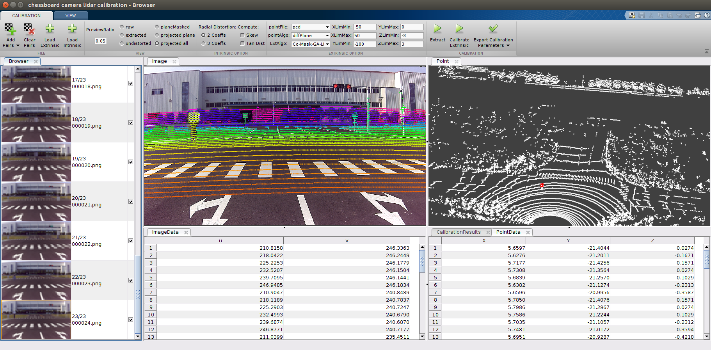
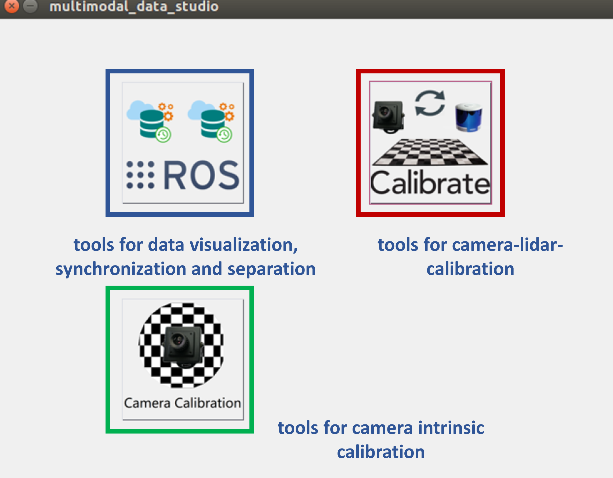

# chessboard_camera_lidar_calibration_toolbox

## Citation
The paper is under review.

## Introduction
This is a matlab-GUI based toobox to calibrate the camera and lidar using the CoMask-based end-to-end method. 

The package is used to calibrate a Lidar with a camera. Specially, the csi camera has been successfully calibrated against Velodyne VLP-16 and Hesai P40P using `chessboard_camera_lidar_calibration_toolbox`. We show the reprojection error by projecting the plane Lidar points to the image plane, which has high accuracy. You can also load other image-lidar pairs captured by the same setup to see the calibration accuracy.  
  
The package finds a rotation and translation that transform all the points in the LiDAR frame to the (monocular) camera frame.  

## Table of Contents
* [Setup](#1)
    - [matlab](#11)
    - [g2o](#12)
    - [sophus](#13)
    - [mex-build](#14)
* [Getting Started](#2)
    - [data preparation](#21)
* [Usage](#3)
* [Future Improvements](#4)

## Setup  
The toolbox is so easy to setup due to the depenence only on [matlab](https://www.mathworks.com/products/matlab.html).  
1. matlab  
For more support for ROS-interface, we strongly suggest you upgrade your matlab version at least after `2017b`. 
2. g2o  
G2O is used to solve the LM optimization problem.  
`cd ./thirdParty/g2o/`  
`mkdir build`  
`cd build`  
`cmake ..`  
`make & sudo make install`  

3. sophus  
sophus is used to convert the problem from euler space to se3 space.  
`cd ./thirdParty/Sophus-1.0.0/`  
`mkdir build`  
`cd build`  
`cmake ..`  
`make & sudo make install`  

3. mex-build   
`cd ./utils/cloudSegmentation`  
`build.m`  
`cd ./utils/optimization`  
`build.m`  

## Getting Started  
The toolbox depends on the image-points-pairs with chessboard. The quality of the data has some relationship the calibration results.  
1. data preparation  
You should prepare the time-sychronized image-points pairs with chessboard exsiting within the overlapped field view of both the camera and Lidar. You do not need too much observations and the distance and orientation of the checkerboard do not has too much limiatation. You can get the sample data with 25 observation from [here](https://drive.google.com/open?id=1zyUtEY5XvnpCCHNaBnGIHAplFIGuCOkX)  
<b>
Additionally, for more robust plane extraction in Lidar points, you'd better provide a static image-point pair with has no chessboard in it. And you should put the **static pair** as the **first one pair**.
</b>

## Usage  

  

You should first run `multimodal_data_studio.m` to launch the GUI as the above.  When the matlab ask you if you want to **change your path** or **add to the path**, you should choose **change your path** to focus on the current path.  
After you click the `chessboard_camera_lidar_calibration_toolbox` button, you will see the GUI interface as the above.  
<b>
As the GUI interface provides conviences for the operator in the realistic application, as it supplies many visualization and interaction tool to view the process and results.
</b>

## Questions

You are welcome to submit questions and bug reports as [GitHub Issues](https://github.com/ccyinlu/chessboard_camera_lidar_calibration_toolbox/issues).

## Copyright and License

## Disclaimer

## Connect with us 
* Ethan: ccyinlu@whu.edu.cn