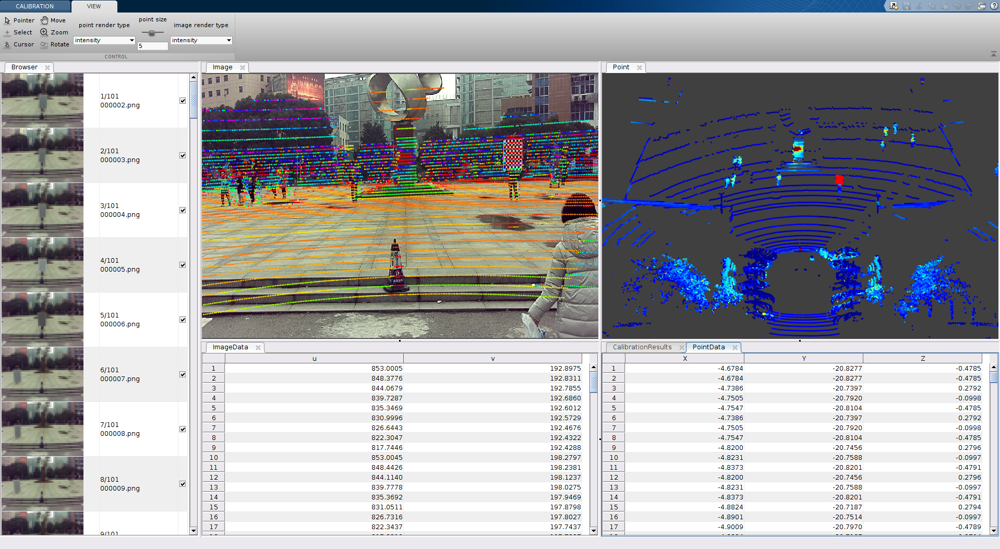
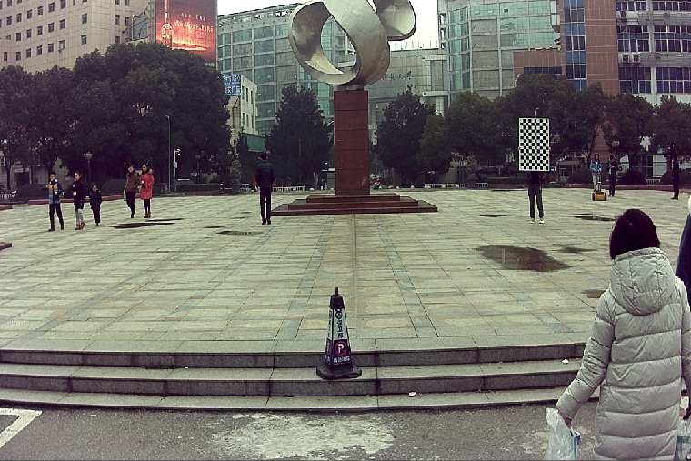
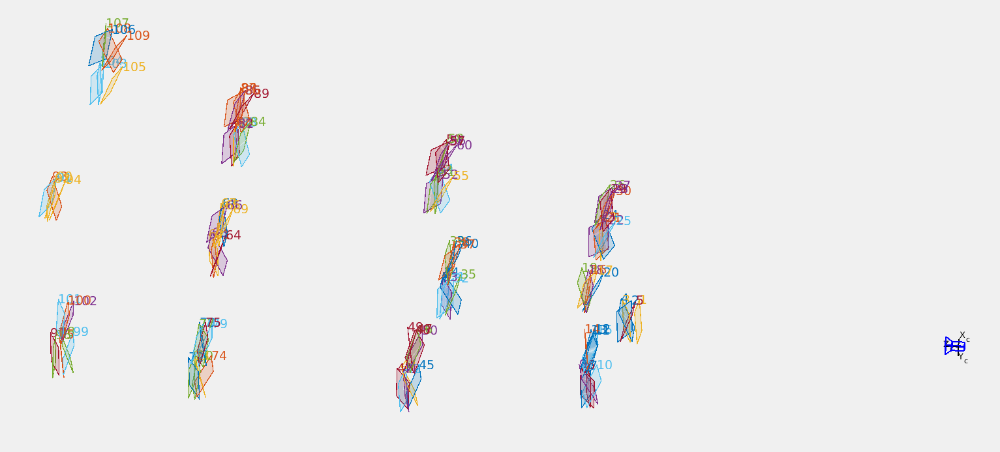
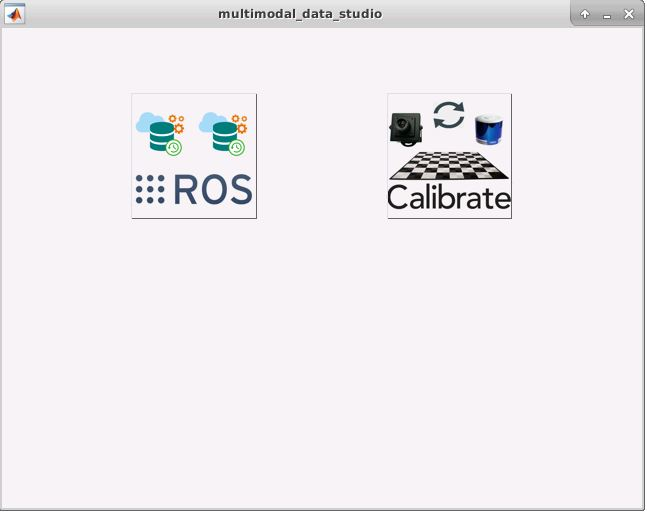
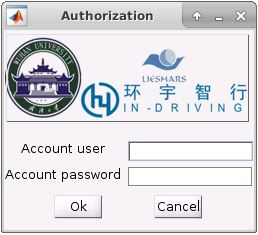

# chessboard_camera_lidar_calibration_toolbox

The package is used to calibrate a Lidar with a camera. Specially, the csi camera has been successfully calibrated against Velodyne VLP-16 and Hesai P40P using `chessboard_camera_lidar_calibration_toolbox`. We show the reprojection error by projecting the plane Lidar points to the image plane, which has high accuracy. You can also load other image-lidar pairs captured by the same setup to see the calibration accuracy.  
  
The package finds a rotation and translation that transform all the points in the LiDAR frame to the (monocular) camera frame. Please see Usage for a [video tutorial](http://47.100.39.180/download/MultiModal_Data_Studio/camera_lidar_calibration_toolbox.mp4).  
  
The toolbox extracts the chessboard plane both from the `image coordinates` and `Lidar points coordinates` automatically, and align the normals of the plane of minimization of the reprojection error to estimate the optimized rotation and translation. The methodolofy of the toolbox derived from the fusion package of the Autoware, which is called [autoware_camera_lidar_calibrator](https://github.com/CPFL/Autoware/tree/master/ros/src/sensing/fusion/packages/autoware_camera_lidar_calibrator).  
  
Compared to the original [autoware_camera_lidar_calibrator](https://github.com/CPFL/Autoware/tree/master/ros/src/sensing/fusion/packages/autoware_camera_lidar_calibrator), the toolbox is developed with matlab language, which is easy to developed and maintain. Additionally, the toolbox provided in this git repository does not rely on [ROS](http://www.ros.org/). Seperate image-point pairs including different image types and lidar point types are supported, such as `pcd` and `binary` type, which is common in [KITTI datasets](http://www.cvlibs.net/datasets/kitti/).  
  
Additionally, calibration process with [autoware_camera_lidar_calibrator](https://github.com/CPFL/Autoware/tree/master/ros/src/sensing/fusion/packages/autoware_camera_lidar_calibrator) needs so much manual interaction and always takes hours to finish a qualified calibration results. However, the automatic tricks reduce the effort in this process.  

## Table of Contents
* [Setup](#1)
    - [matlab](#11)
    - [NLOPT-ubuntu](#12)
    - [NLOPT-windows](#12)
* [Getting Started](#2)
    - [data preparation](#21)
* [Usage](#3)
* [Fusion using `chessboard_camera_lidar_calibration`](#4)
* [Future Improvements](#5)

## Setup  
The toolbox is so easy to setup due to the depenence only on [matlab](https://www.mathworks.com/products/matlab.html).  
1. matlab  
For more support for ROS-interface, we strongly suggest you upgrade your matlab version at least after `2017a`. 
2. NLOPT-ubuntu  
[NLopt](https://nlopt.readthedocs.io/en/latest/) is a free/open-source library for nonlinear optimization, providing a common interface for a number of different free optimization routines available online as well as original implementations of various other algorithms.  
The optimization of the toolbox depends on NLOPT, so we need to build the [NLOPT plugins](https://nlopt.readthedocs.io/en/latest/NLopt_Installation/) for matlab.  
`cd ./thirdParty/nlopt-2.5.0/`  
`mkdir build`  
`cd build`  
`cmake -DMatlab_ROOT_DIR=/usr/local/MATLAB/R2017b -DINSTALL_MEX_DIR=/usr/local/MATLAB/R2017b/mex ..`  
`make`  
***Attention***:  
You can change the `Matlab_ROOT_DIR` and `INSTALL_MEX_DIR` according to your own configuration, do not forget add the `INSTALL_MEX_DIR` to your **matlab searching path** in order to use **NLOPT** normally. 

3. NLOPT-windows  
Enable `NLOPT` on the windows OS, you can follow the [Official Tutorial](https://nlopt.readthedocs.io/en/latest/NLopt_on_Windows/) to install the `NLOPT plugin` for `matlab interface`.  
In the released package, we have include the built `mex` files within the `./thirdParty/nlopt/windows/mex` directory, you should only copy the `libnlopt-0.dll` to the matlab directory `WHERE_YOUR_MATLAB_INSTALLATION\bin\win64`.  
If you want to build your own `mex` file. then follow the tips below:  
    - download the [precompiled 64-bit windows DLLs](http://ab-initio.mit.edu/nlopt/nlopt-2.4.2-dll64.zip)  
    - unzip the [nlopt-2.4.2-dll64.zip](http://ab-initio.mit.edu/nlopt/nlopt-2.4.2-dll64.zip) and cd to the directory `nlopt-2.4.2-dll64`  
    - copy the DLL file `libnlopt-0.dll` to `WHERE_YOUR_MATLAB_INSTALLATION\bin\win64`, for example `C:\Program Files\MATLAB\R2017b\bin\win64`  
    - convert the Dll file to lib file, we strongly suggest you to use the [GNU compilers(minGW)](https://en.wikipedia.org/wiki/MinGW). If you are using GNU compilers (MinGW), run the following command(dlltool comes with MinGW) in `command` or `powerShell`:  
    `dlltool --input-def libnlopt-0.def --dllname libnlopt-0.dll --output-lib libnlopt-0.lib`  
    For example, in my windows computer, the command looks like:  
    `C:\TDM-GCC-64\x86_64-w64-mingw32\bin\dlltool --input-def libnlopt-0.def --dllname libnlopt-0.dll --output-lib libnlopt-0.lib`  
    - Copy the `nlopt_optimize.c` from `nlopt-2.4.2-dll64\matlab` to `nlopt-2.4.2-dll64`, you will find the source file `nlopt_optimize.c`, the header file `nlopt.h` and the lib file `libnlopt-0.lib` under the directory `nlopt-2.4.2-dll64`.  
    - Using the `mex` command in the `matlab command`:  
    `mex -L. -lnlopt-0 nlopt_optimize.c`  
    After the command returns successfully, you will find `nlopt_optimize.mexw64` within the current diretory.  
    - Copy the `nlopt_optimize.mexw64` to the directory `nlopt-2.4.2-dll64\matlab` and set the directory to the searching path of matlab using command `addpath`.  
    

## Getting Started  
The toolbox depends on the image-points-pairs with chessboard. The quality of the data has great influence on the calibration results.  
1. data preparation  
You should prepare the time-sychronized image-points pairs with chessboard exsiting within the overlapped field view of both the camera and Lidar.  

  

You should get as much as orientation and position of the chessboard as descriped below, which has at least **5 poses** each position and different distance between the chessboard and camera.  
  
For more requirement of the data, you can refer to the tutorial of the [Autoware - How to Calibrate Camera](https://github.com/CPFL/Autoware/wiki/Calibration).  

  

Additionally, for more robust plane extraction in Lidar points, you'd better provide a static image-point pair with has no chessboard in it. And you should name the **static pair** as the **first one pair**.  

## Usage  
In the `MultiModal_data_studio` toolboxes, you may need to be authorized before you can use the `cheesboard_camera_lidar_calibration_toolbox`. Feel free to contact the author `ccyinlu@whu.edu.cn` to get the valid `account`.  

  

You should first run `multimodal_data_studio.m` to launch the GUI as the above.  When the matlab ask you if you want to **change your path** or **add to the path**, you should choose **change your path** to focus on the current path.  
After you click the `chessboard_camera_lidar_calibration_toolbox` button, you will be confronted with an `authorization` dialog to validate yourself.  

  

Feel free to contact the `ccyinlu@whu.edu.cn` to get the `account` and have a try.

## Fusion  
Project the lidar points to the image using the `calibration file` and the points are rendered according to `range`.

Project the lidar points to the image using the `calibration file` and the points are rendered according to `height`.

Set a threshold to simply filter the ground points.

## Questions

You are welcome to submit questions and bug reports as [GitHub Issues](https://github.com/ccyinlu/chessboard_camera_lidar_calibration_toolbox/issues).

## Copyright and License

## Disclaimer

## Connect with us 
* Ethan: ccyinlu@whu.edu.cn